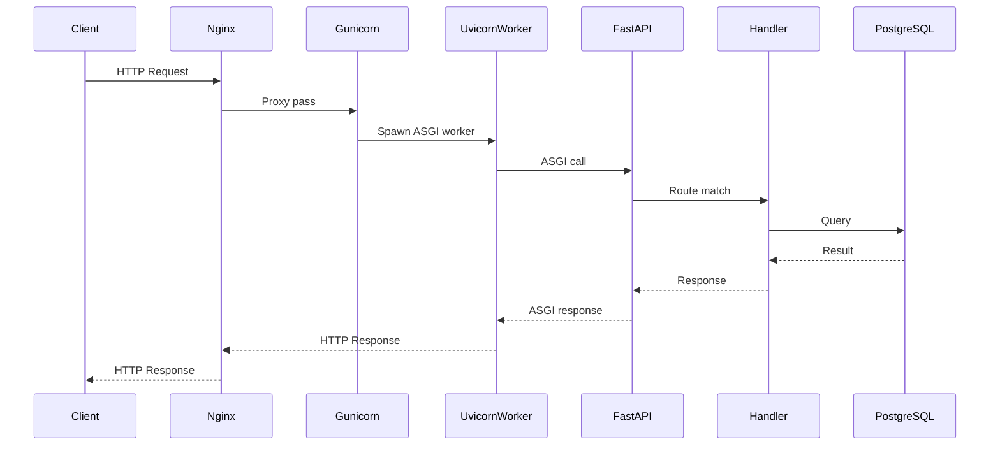
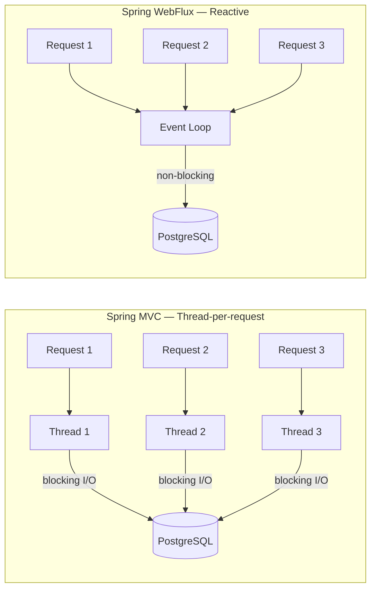

# web-stack-benchmark

> Same database. Same data. Same load tests. Only the backend changes.

A structured benchmark comparing HTTP server stacks across different languages and concurrency models. Every implementation exposes identical endpoints, connects to the same PostgreSQL instance, and is tested with the same load scripts — isolating the backend as the only variable.

---

## Goal

Understand **how** and **why** different stacks perform the way they do — not just the numbers, but the concurrency model, memory usage, and behavior under pressure behind each result.

---

## Stacks

| # | Stack | Language | Model |
|---|---|---|---|
| 1 | Spring MVC | Kotlin | Thread-per-request (blocking) |
| 2 | Spring WebFlux | Kotlin | Reactive / non-blocking |
| 3 | FastAPI + Uvicorn | Python | Async I/O (single process) |
| 4 | FastAPI + Gunicorn | Python | Multi-process workers |
| 5 | Go net/http | Go | Goroutines |

---

## Endpoints (identical across all stacks)

```
GET  /hello          → no I/O — measures raw framework overhead
GET  /users          → SELECT with pagination — light I/O
POST /users/search   → filtered query — real I/O with logic
```

---

## Metrics

- **Throughput** — requests per second (RPS)
- **Latency** — p50, p95, p99
- **Memory** — RSS under load
- **Concurrency** — behavior under 10, 100, 500 simultaneous connections
- **Error rate** — drops and timeouts under stress

---

## Load Testing Tools

| Tool | Purpose |
|---|---|
| `wrk` | Maximum RPS — raw throughput with minimal overhead |
| `k6` | Realistic scenarios — ramp-up, spikes, thresholds |
| `autocannon` | Quick smoke tests for CI |

All scripts are parameterized by port, so the same test runs against any backend without modification.

---

## Architecture

```
┌─────────┐     ┌───────┐     ┌─────────────────┐     ┌──────────┐
│ wrk/k6  │────▶│ Nginx │────▶│  Backend (n)     │────▶│ Postgres │
└─────────┘     └───────┘     └─────────────────┘     └──────────┘
```

Each backend runs on its own port (`8081`, `8082`, ...). Nginx sits in front as a reverse proxy. All backends share the same PostgreSQL instance with the same seeded data.

---

## Request Flow — FastAPI with Gunicorn



---

## Concurrency Models



---

## Project Structure

```
web-stack-benchmark/
├── infra/
│   ├── docker-compose.yml       # full stack — all backends + postgres + nginx
│   ├── nginx/
│   │   └── nginx.conf
│   └── postgres/
│       ├── schema.sql
│       └── seed.sql
├── load-tests/
│   ├── k6/
│   │   ├── scenarios/
│   │   │   ├── ramp-up.js
│   │   │   ├── spike.js
│   │   │   └── steady.js
│   │   └── thresholds.js
│   ├── wrk/
│   │   └── scripts/
│   ├── autocannon/
│   │   └── smoke.js
│   └── results/
│       ├── raw/
│       └── reports/
├── implementations/
│   ├── spring-mvc-kotlin/
│   ├── spring-webflux-kotlin/
│   ├── fastapi-async/
│   ├── fastapi-gunicorn/
│   └── go-stdlib/
└── docs/
    ├── methodology.md
    ├── results.md
    ├── architecture/
    │   ├── spring-mvc.md
    │   ├── spring-webflux.md
    │   └── fastapi.md
    └── concepts/
        ├── threads-vs-async.md
        ├── event-loop.md
        └── gil-python.md
```

---

## Running

```bash
# Start infrastructure
docker-compose -f infra/docker-compose.yml up -d

# Run k6 against a specific backend (by port)
k6 run -e PORT=8081 load-tests/k6/scenarios/steady.js

# Run wrk
wrk -t4 -c100 -d30s http://localhost:8081/users

# Run autocannon smoke test
node load-tests/autocannon/smoke.js --port 8081
```

---

## Results

> Results will be published in [`docs/results.md`](docs/results.md) as each implementation is completed.

---

## Docs

- [Methodology](docs/methodology.md) — how tests were conducted and what was controlled
- [Threads vs Async](docs/concepts/threads-vs-async.md)
- [Python GIL and why Gunicorn sometimes wins](docs/concepts/gil-python.md)
- [Event Loop explained](docs/concepts/event-loop.md)

---

## Status

| Stack | Implemented | Tested | Documented |
|---|---|---|---|
| Spring MVC (Kotlin) | 🚧 | ⬜ | ⬜ |
| Spring WebFlux (Kotlin) | ⬜ | ⬜ | ⬜ |
| FastAPI async | ⬜ | ⬜ | ⬜ |
| FastAPI + Gunicorn | ⬜ | ⬜ | ⬜ |
| Go net/http | ⬜ | ⬜ | ⬜ |

---

## License

MIT
