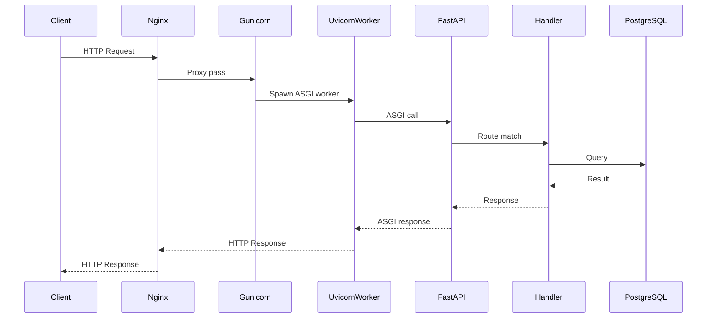
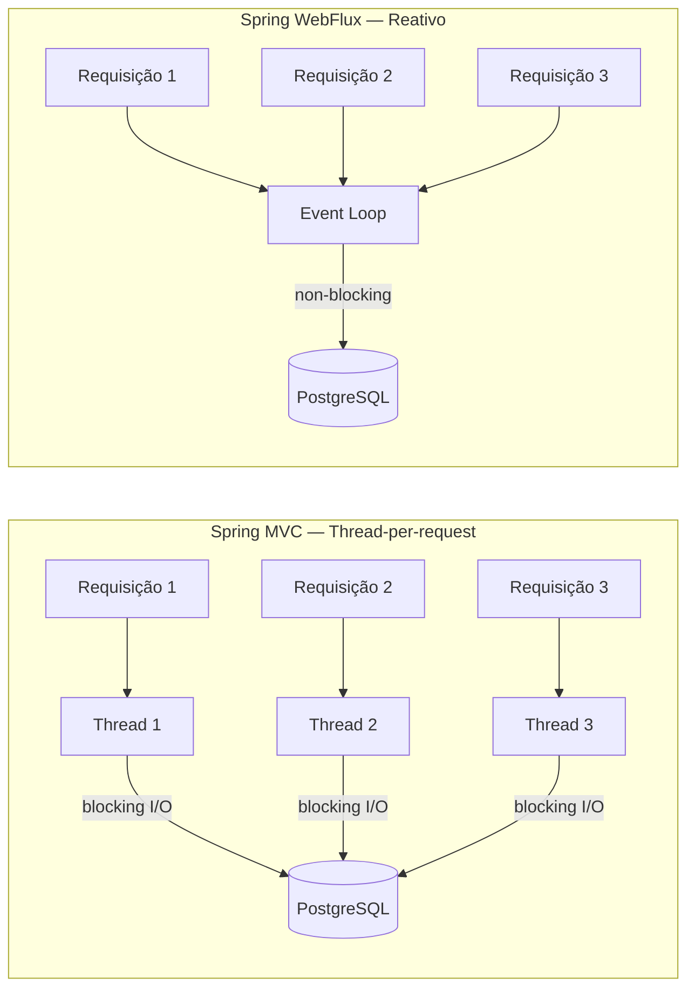

# web-stack-benchmark

> Mesmo banco de dados. Mesmos dados. Mesmos testes de carga. Só o backend muda.

Um benchmark estruturado comparando diferentes stacks HTTP em linguagens e modelos de concorrência distintos. Cada implementação expõe os mesmos endpoints, conecta na mesma instância do PostgreSQL e é testada com os mesmos scripts de carga — isolando o backend como única variável.

---

## Objetivo

Entender **como** e **por que** cada stack performa do jeito que performa — não só os números, mas o modelo de concorrência, uso de memória e comportamento sob pressão por trás de cada resultado.

---

## Stacks

| # | Stack | Linguagem | Modelo |
|---|---|---|---|
| 1 | Spring MVC | Kotlin | Thread-per-request (bloqueante) |
| 2 | Spring WebFlux | Kotlin | Reativo / non-blocking |
| 3 | FastAPI + Uvicorn | Python | Async I/O (processo único) |
| 4 | FastAPI + Gunicorn | Python | Multi-process workers |
| 5 | Go net/http | Go | Goroutines |

---

## Endpoints (idênticos em todas as stacks)

```
GET  /hello          → sem I/O — mede o overhead puro do framework
GET  /users          → SELECT com paginação — I/O leve
POST /users/search   → query com filtros — I/O real com lógica
```

---

## Métricas

- **Throughput** — requisições por segundo (RPS)
- **Latência** — p50, p95, p99
- **Memória** — RSS sob carga
- **Concorrência** — comportamento com 10, 100 e 500 conexões simultâneas
- **Taxa de erro** — drops e timeouts sob stress

---

## Ferramentas de Carga

| Ferramenta | Propósito |
|---|---|
| `wrk` | RPS máximo — throughput bruto com overhead mínimo |
| `k6` | Cenários realistas — ramp-up, picos, thresholds |
| `autocannon` | Smoke tests rápidos para CI |

Todos os scripts são parametrizados por porta, então o mesmo teste roda em qualquer backend sem modificação.

---

## Arquitetura

```
┌─────────┐     ┌───────┐     ┌─────────────────┐     ┌──────────┐
│ wrk/k6  │────▶│ Nginx │────▶│  Backend (n)     │────▶│ Postgres │
└─────────┘     └───────┘     └─────────────────┘     └──────────┘
```

O Nginx (porta `8080`) fica na frente como reverse proxy e roteia para o backend selecionado via profile. Todos os backends compartilham a mesma instância do PostgreSQL com os mesmos dados.

---

## Fluxo de Requisição — FastAPI com Gunicorn



---

## Modelos de Concorrência



---

## Estrutura do Projeto

```
web-stack-benchmark/
├── infra/
│   ├── docker-compose.yml       # stack completa — perfis de backend + postgres + nginx
│   ├── nginx/
│   │   └── nginx.conf.template  # reverse proxy config (envsubst)
│   └── postgres/
│       ├── schema.sql
│       └── seed.sql
├── load-tests/
│   ├── k6/
│   │   ├── scenarios/
│   │   │   ├── ramp-up.js
│   │   │   ├── spike.js
│   │   │   └── steady.js
│   │   └── thresholds.js
│   ├── wrk/
│   │   └── scripts/
│   ├── autocannon/
│   │   └── smoke.js
│   └── results/
│       ├── raw/
│       └── reports/
├── implementations/
│   ├── spring-mvc-kotlin/
│   ├── spring-webflux-kotlin/
│   ├── fastapi-async/
│   ├── fastapi-gunicorn/
│   └── go-stdlib/
└── docs/
    ├── metodologia.md
    ├── resultados.md
    ├── arquitetura/
    │   ├── spring-mvc.md
    │   ├── spring-webflux.md
    │   └── fastapi.md
    └── conceitos/
        ├── threads-vs-async.md
        ├── event-loop.md
        └── gil-python.md
```

---

## Como Rodar

```bash
# Subir infra + backend específico (do diretório infra/)
BACKEND_HOST=spring-mvc     docker compose --profile spring-mvc up
BACKEND_HOST=spring-webflux docker compose --profile spring-webflux up

# Ou de qualquer lugar (especificando o arquivo)
BACKEND_HOST=spring-mvc docker compose -f infra/docker-compose.yml --profile spring-mvc up

# Rodar testes de carga (com o backend rodando em 8080)
k6 run -e PORT=8080 load-tests/k6/scenarios/steady.js
wrk -t4 -c100 -d30s http://localhost:8080/users

# Resetar banco de dados
docker compose --profile <perfil> down -v
```

---

## Resultados

> Os resultados serão publicados em [`docs/resultados.md`](docs/resultados.md) conforme cada implementação for concluída.

---

## Documentação

- [Metodologia](docs/metodologia.md) — como os testes foram conduzidos e o que foi controlado
- [Threads vs Async](docs/conceitos/threads-vs-async.md)
- [GIL do Python e por que o Gunicorn às vezes vence](docs/conceitos/gil-python.md)
- [Event Loop explicado](docs/conceitos/event-loop.md)

---

## Status

| Stack | Código | Docker | Testado |
|---|---|---|---|---|
| Spring MVC (Kotlin) | ✅ | ✅ | ⬜ |
| Spring WebFlux (Kotlin) | ✅ | ✅ | ⬜ |
| FastAPI async | ⬜ | ⬜ | ⬜ |
| FastAPI + Gunicorn | ⬜ | ⬜ | ⬜ |
| Go net/http | ⬜ | ⬜ | ⬜ |

---

## Licença

MIT
