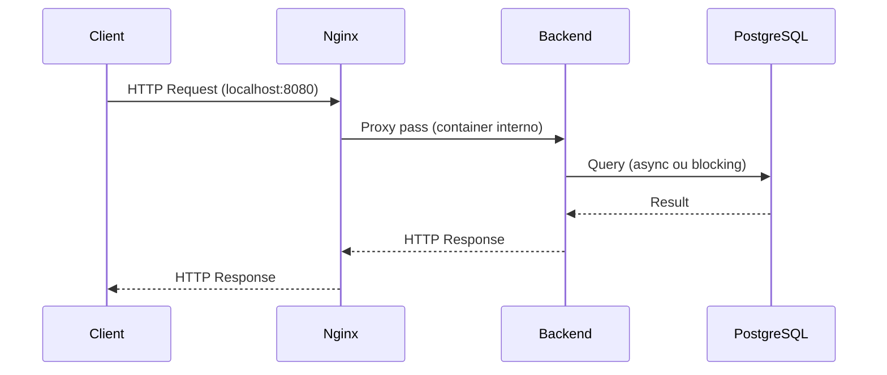
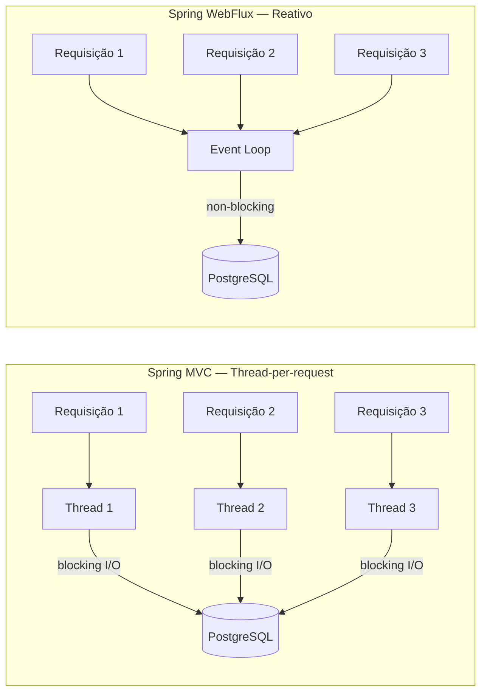

# web-stack-benchmark

> Mesmo banco de dados. Mesmos dados. Mesmos testes de carga. Só o backend muda.

Um benchmark estruturado comparando diferentes stacks HTTP em linguagens e modelos de concorrência distintos. Cada implementação expõe os mesmos endpoints, conecta na mesma instância do PostgreSQL e é testada com os mesmos scripts de carga — isolando o backend como única variável.

---

## Objetivo

Entender **como** e **por que** cada stack performa do jeito que performa — não só os números, mas o modelo de concorrência, uso de memória e comportamento sob pressão por trás de cada resultado.

---

## Stacks

| # | Stack | Linguagem | ORM | Modelo |
|---|---|---|---|---|
| 1 | Spring MVC | Kotlin | Hibernate (JDBC) | Thread-per-request (bloqueante) |
| 2 | Spring WebFlux | Kotlin | Hibernate (R2DBC) | Reativo / non-blocking |
| 3 | FastAPI + Uvicorn | Python | asyncpg nativo | Async I/O |
| 4 | Go + Gin | Go | pgx (raw SQL) | Goroutines |
| 5 | Node Fastify | TypeScript | raw SQL (postgres) | Cluster mode (workers = CPUs) |
| 6 | Rust + Axum | Rust | sqlx (tokio-postgres) | Async I/O (Tokio) |

---

## Endpoints (idênticos em todas as stacks)

```
GET  /users/hello    → sem I/O — mede o overhead puro do framework
GET  /users          → SELECT com paginação — I/O leve
POST /users/search   → query com filtros — I/O real com lógica
```

---

## Métricas

- **Throughput** — requisições por segundo (req/s)
- **Latência** — p50, p90, p95
- **Taxa de erro** — requisições com falha sob stress

---

## Ferramentas de Carga

| Ferramenta | Propósito |
|---|---|
| `k6` | 3 cenários: Steady State (200 VUs, 30s), Ramp-up (0→500 VUs, 80s), Spike (50→500→50 VUs, 75s) |

Todos os cenários acessam as 3 rotas por iteração (`/users/hello`, `/users`, `/users/search`) contra `localhost:8080` (nginx).

---

## Arquitetura

```
┌─────────┐     ┌───────┐     ┌─────────────────┐     ┌──────────┐
│ k6      │────▶│ Nginx │────▶│  Backend (n)     │────▶│ Postgres │
└─────────┘     └───────┘     └─────────────────┘     └──────────┘
```

O Nginx (porta `8080`) fica na frente como reverse proxy e roteia para o backend selecionado via profile. Todos os backends compartilham a mesma instância do PostgreSQL com os mesmos dados.

---

## Fluxo de Requisição


```mermaid
sequenceDiagram
    Client->>Nginx: HTTP Request (localhost:8080)
    Nginx->>Backend: Proxy pass (container interno)
    Backend->>PostgreSQL: Query (async ou blocking)
    PostgreSQL-->>Backend: Result
    Backend-->>Nginx: HTTP Response
    Nginx-->>Client: HTTP Response
```

---

## Modelos de Concorrência


```mermaid
flowchart LR
    subgraph MVC["Spring MVC — Thread-per-request"]
        R1[Requisição 1] --> T1[Thread 1]
        R2[Requisição 2] --> T2[Thread 2]
        R3[Requisição 3] --> T3[Thread 3]
        T1 -->|blocking I/O| DB1[(PostgreSQL)]
        T2 -->|blocking I/O| DB1
        T3 -->|blocking I/O| DB1
    end

    subgraph WebFlux["Spring WebFlux — Reativo"]
        R4[Requisição 1] --> EL[Event Loop]
        R5[Requisição 2] --> EL
        R6[Requisição 3] --> EL
        EL -->|non-blocking| DB2[(PostgreSQL)]
    end
```

---

## Estrutura do Projeto

```
web-stack-benchmark/
├── infra/
│   ├── docker-compose.yml        # perfis: postgres + nginx + backend escolhido
│   ├── nginx/
│   │   ├── nginx.conf            # reverse proxy config
│   │   └── nginx.conf.template   # template com envsubst (BACKEND_HOST)
│   └── postgres/
│       ├── schema.sql            # tabelas + índices
│       └── seed.sql              # 10.000 usuários (9.000 ativos)
├── load-tests/
│   ├── k6/
│   │   ├── config.js             # BASE_URL + thresholds globais
│   │   ├── scenarios/
│   │   │   ├── steady.js         # 200 VUs, 30s, sem sleep
│   │   │   ├── ramp-up.js        # 0→500 VUs em estágios, 80s
│   │   │   └── spike.js          # 50→500→50 VUs, 75s
│   │   └── (relatórios gerados manualmente via resultados.md)
├── implementations/
│   ├── spring-mvc-kotlin/        # Kotlin + Hibernate (JDBC)
│   ├── spring-webflux-kotlin/    # Kotlin + Hibernate (R2DBC)
│   ├── fastapi-async/            # Python + asyncpg nativo
│   ├── go-gin/                   # Go + Gin + pgx (raw SQL)
│   ├── node-fastify/             # TypeScript + Fastify + raw SQL
│   └── rust-axum/                # Rust + Axum + sqlx
└── docs/
    ├── resultados.md             # relatório consolidado (manual)
    └── results/
        ├── escalabilidade.md     # curva de escalabilidade (automático)
        └── {config}/
            └── {stack}/          # JSONs + .md por config
```

---

## Como Rodar

```bash
# 1. Editar .env com a config desejada
#    CPUS=1 / MEM_LIMIT=1G (padrão) ou 2/2G, 4/4G, 8/8G, 12/12G

# 2. Subir infra base (postgres + nginx) — uma vez
docker compose -f infra/docker-compose.yml --env-file .env up -d

# 3. Subir o backend escolhido
docker compose -f implementations/rust-axum/docker-compose.yml --env-file .env up -d --build

# 4. Rodar testes de carga
k6 run load-tests/k6/scenarios/steady.js
k6 run load-tests/k6/scenarios/ramp-up.js
k6 run load-tests/k6/scenarios/spike.js

# 5. Derrubar backend e trocar para outro
docker compose -f implementations/rust-axum/docker-compose.yml down
docker compose -f implementations/node-fastify/docker-compose.yml --env-file .env up -d --build

# 6. Resetar tudo (inclusive banco)
docker compose -f infra/docker-compose.yml --env-file .env down -v
```

---

## Resultados

> Relatório completo: [`docs/resultados.md`](docs/resultados.md). Relatórios automáticos por config: [`docs/results/escalabilidade.md`](docs/results/escalabilidade.md).

---

## Documentação

- [Resultados](docs/resultados.md) — relatório consolidado com análise
- [Escalabilidade](docs/results/escalabilidade.md) — dados brutos e curva por config

---

## Status

| Stack | Código | Docker | Testado |
|---|---|---|---|
| Go + Gin (pgx raw) | ✅ | ✅ | ✅ |
| Rust + Axum (sqlx) | ✅ | ✅ | ✅ |
| Spring WebFlux (R2DBC) | ✅ | ✅ | ✅ |
| Spring MVC (JDBC) | ✅ | ✅ | ✅ |
| Node Fastify (cluster) | ✅ | ✅ | ✅ |
| FastAPI Async (asyncpg) | ✅ | ✅ | ✅ |

---

## Licença

MIT
